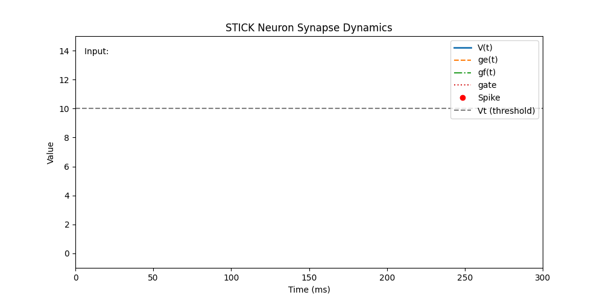

# Neuron Model in Axon

This document details the spiking **neuron model** used in Axon, which implements the [STICK](https://arxiv.org/abs/1507.06222) computational paradigm. STICK uses temporal coding, precise spike timing, and synaptic diversity for symbolic and deterministic computation.

> [STICK: Spike Time Interval Computational Kernel, A Framework for General Purpose Computation using Neurons, Precise Timing, Delays, and Synchrony](https://arxiv.org/abs/1507.06222).

##  Overview

Axon simulates event-driven, **integrate-and-fire neurons** with:
- **Millisecond-precision** spike timing
- Multiple **synapse types** with distinct temporal effects
- Explicit **gating** to modulate temporal dynamics

The base classes are:
- `AbstractNeuron`: defines core membrane equations
- `ExplicitNeuron`: tracks spike times and enables connectivity
- `Synapse`: defines delayed, typed connections between neurons

## Neuron Dynamics

Each neuron maintains five internal state variables:

| Variable | Description |
|----------|-------------|
| `V`      | Membrane potential |
| `ge`     | Persistent excitatory input (constant) |
| `gf`     | Fast exponential input (gated) |
| `gate`   | Binary gate controlling `gf` integration |
| `Vt`      | Membrane potential threshold |

The membrane potential evolves following the differential equation:

\\[ \tau_m \frac{dV}{dt} = g_e + \text{gate} \cdot g_f \\]
\\[ \frac{dg_e}{dt} = 0 \\]
\\[ \tau_f \frac{dg_f}{dt} = -g_f \\]

When the membrane potential surpasess a threshold, `V > Vt`, the neuron emits a spike and **resets**:

```text
V → Vreset
ge → 0
gf → 0
gate → 0
```

Reset guarantees clean operation for subsequent intervals.

##  Synapse Types

The neuron model supports four synapse types with a certain *weight* (`w`).

| Type   | Effect                                  |
|--------|------------------------------------------|
| `V`    | Immediate change in membrane: `V += w`   |
| `ge`   | Adds persistent drive: `ge += w`         |
| `gf`   | Adds fast decaying drive: `gf += w`      |
| `gate` | Toggles gate flag (w = ±1) to activate `gf` |

Each synapse also includes a configurable delay, enabling precise temporal computation.


##  Numerical Parameters

**Typical neuron parameter** values used in Axon:

| Parameter | Value    | Meaning                        |
|-----------|----------|--------------------------------|
| `Vt`      | 10.0  | Spiking threshold              |
| `Vreset`  | 0.0  | Voltage after reset            |
| `τm`      | 100.0 | Membrane integration constant  |
| `τf`      | 20.0  | Fast synaptic decay constant   |

Units are in **milliseconds** and **millivolts**, matching real-time symbolic processing and neuromorphic feasibility.


## Benefits of This Model

This neuron model is designed for **interval-coded** values. Time **intervals between spikes** directly encode numeric values.

The neuron model has dynamic behaviours that eenable symbolic operations such as memory, arithmetic, and differential equation solving. The dynamics of this neuron model forms a **Turing-complete** computation framework (for in depth information, refer to the [STICK paper](https://arxiv.org/abs/1507.06222)).

This neuron model has the following characteristics:

- **Compact**: Minimal neurons required for functional blocks
- **Precise**: Accurate sub-millisecond spike-based encoding
- **Composable**: Modular design supports hierarchical circuits
- **Hardware-Compatible**: Ported to digital integrate-and-fire cores

## Neuron Model Animation



This animation demonstrates how a single STICK neuron responds over time to different synaptic inputs. Each input type (`V`, `ge`, `gf`, `gate`) produces distinct changes in membrane dynamics. Synapse-type `ge` produces a linear increase of `V` and `gf` an exponential one.

### Summary of Synapse Effects

| Synapse Type | Behavior |
|--------------|----------|
| `V`          | Instantaneous jump in membrane potential `V` |
| `ge`         | Slow, steady increase in `V` over time |
| `gf + gate`  | Fast, nonlinear voltage rise due to exponential dynamics |
| `gate`       | Controls whether `gf` affects the neuron at all |

###  Event-by-event explanation

| Time (ms) | Type    | Value | Description |
|-----------|---------|-------|-------------|
| `t = 20`  | `V`     | 10.0  | Instantaneously pushes `V` to threshold: triggers immediate spike |
| `t = 60`  | `ge`    | 2.0   | Applies constant integration current: slow, linear voltage increase |
| `t = 100` | `gf`    | 2.5   | Adds fast-decaying input, gated via `gate = 1` at same time |
| `t = 160` | `V`     | 2.0   | Small, instant boost to `V` |
| `t = 200` | `gate`  | -1.0  | Disables exponential decay pathway by zeroing the gate signal |

---

###  `t = 20 ms - V(10.0)`
- A **V-synapse** adds +10.0 mV to `V` instantly.
- Since `Vt = 10.0`, this causes **immediate spike**.
- The neuron resets: `V → 0`, `ge, gf, gate → 0`.

**Effect**: Demonstrates a direct spike trigger via instantaneous voltage jump.

---

###  `t = 60 ms — ge(2.0)`
- A **ge-synapse** applies constant input current.
- Voltage rises **linearly** over time.
- Alone, this isn't sufficient to reach `Vt`, so no spike occurs yet.

**Effect**: Shows the smooth effect of continuous integration from ge-type input.

---

###  `t = 100 ms — gf(2.5)` and `gate(1.0)`
- A **gf-synapse** delivers fast-decaying input current.
- A **gate-synapse** opens the gate (`gate = 1`), activating `gf` dynamics.
- Voltage rises **nonlinearly** as `gf` initially dominates, then decays.
- Combined effect from earlier `ge` and `gf` **causes a spike** shortly after.

**Effect**: Demonstrates exponential integration (gf) gated for a temporary burst.

---

###  `t = 160 ms — V(2.0)`
- A small **V-synapse** bump of +2.0 mV occurs.
- This is **not enough** to cause a spike, but it shifts `V` upward instantly.

**Effect**: Shows subthreshold perturbation from a V-type synapse.


###  `t = 200 ms — gate(-1.0)`
- The **gate is closed** (`gate = 0`), disabling `gf` decay term.
- Any remaining `gf` is no longer integrated into `V`.

**Effect**: Demonstrates control logic: `gf` is disabled, computation halts.
