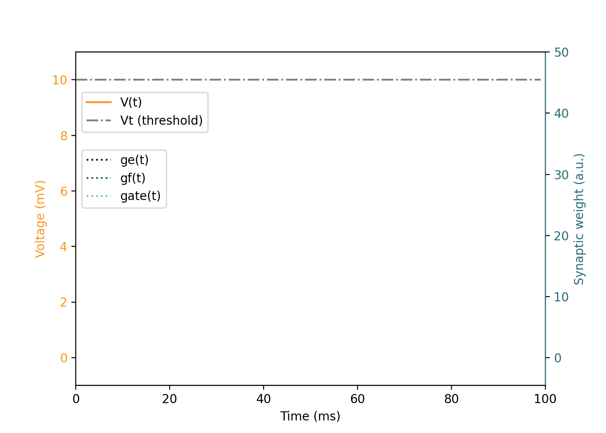

# Neuron Model

This document details the spiking **neuron model** used in Axon, which implements the [STICK](https://arxiv.org/abs/1507.06222) computation framework. STICK uses temporal coding, precise spike timing, and synaptic diversity for symbolic and deterministic computation.

> [STICK: Spike Time Interval Computational Kernel, A Framework for General Purpose Computation using Neurons, Precise Timing, Delays, and Synchrony](https://arxiv.org/abs/1507.06222).

---

##  Overview

Axon simulates event-driven, **integrate-and-fire neurons** with:
- **Millisecond-precision** spike timing
- Multiple **synapse types** with distinct temporal effects
- Explicit **gating** to modulate temporal dynamics

The base classes are:
- `AbstractNeuron`: defines core membrane equations
- `ExplicitNeuron`: tracks spike times and enables connectivity
- `Synapse`: defines delayed, typed connections between neurons


## Neuron Dynamics

Axon simulates event-driven **non-leaky integrate-and-fire neurons**.

The membrane potentail (`V`) evolves following the differential equations:

\\[ \tau_m \frac{dV}{dt} = g_e + \text{gate} \cdot g_f \\]
\\[ \frac{dg_e}{dt} = 0 \\]
\\[ \tau_f \frac{dg_f}{dt} = -g_f \\]

Each neuron has 4 internal state variables:

| Variable | Description |
|----------|-------------|
| `V`      | Membrane potential |
| `ge`     | Constant input |
| `gf`     | Exponential input |
| `gate`   | Binary gate controlling `gf` |

Each neuron also has 4 internal parameters:

| Parameter | Description |
|----------|-------------|
| `Vt`      | Membrane potential threshold |
| `Vreset`      | Membrane potential set after a reset |
| `tm`     | Timescale of the evolution of the membrane potential|
| `tf`     | Timescale of the evolution of `gf` |

When the membrane potential surpasess a threshold, `V > Vt`, the neuron emits a spike and **resets**:

```text
if V > Vt:
    spike → 1
    V → Vreset
    ge → 0
    gf → 0
    gate → 0
```

## Neuron Model Animation

This animation demonstrates the evolution of an individual neuron under different synaptic inputs (`V`, `ge`, `gf`, `gate`):



| Synapse Type | Behavior |
|--------------|----------|
| `V`          | Instantaneous jump in membrane potential `V`, potentially emitting spike |
| `ge`         | Slow, steady increase in `V` over time |
| `gf + gate`  | Fast, nonlinear voltage rise due to exponential dynamics |
| `gate`       | Controls whether `gf` affects the neuron at all |


###  Event-by-event explanation of the animation

| Time (ms) | Type    | Value | Description |
|-----------|---------|-------|-------------|
| `t = 10`  | `V`     | 3.0  | Instantaneous pushes of `V`, membrane potential
| `t = 25`  | `ge`    | 6.0   | Applies constant integration current: slow, linear voltage increase |
| `t = 40` | `gf`    | 16.0   | Adds fast-decaying input, gated via `gate = 1` at same time |
| `t = 40` | `gate`     | 1.0   | Enables `gf` affecting neuron dynamics |
| `t = 85` | `spike`     | -   | Neuron emits a spike and resets its state |


##  Synapse Types

The neuron model has 4 synapse types. Each of them affects one of the 4 internal state variables of the neuron receiving the synapse. Synapses have a certain **weight (`w`)**:

| Synapse Type   | Effect                                  | Explanation |
|--------|------------------------------------------|---|
| `V`    | `V += w` | Immediate change in membrane potential |
| `ge`   | `ge += w` | Adds to the constant input |
| `gf`   | `gf += w` | Adds to the exponential input |
| `gate` | `gate += w` | Toggles gate flag (`w = ±1`) to activate `gf` |

Besides it's weight `w`, wach synapse also includes a delay, controlling the the time taken by a spike travelling through the synapse to arrive to the following neuron and affecting it's internal state:

```text
synapse
  | weight
  | delay
```


##  Numerical Parameters

By default, Axon uses the following **numeric values** for the neuron parameters

| Parameter | Numeric value (mV, ms)    | Meaning                        |
|-----------|----------|--------------------------------|
| `Vt`      | 10.0  | Spiking threshold              |
| `Vreset`  | 0.0  | Voltage after reset            |
| `tm`      | 100.0 | Membrane integration constant  |
| `tf`      | 20.0  | Fast synaptic decay constant   |

Units are **milliseconds** for time values and **millivolts** for membrane potential values.

## Benefits of This Model

This neuron model is designed for **interval-coded** values. Time **intervals between spikes** directly encode numeric values.

The neuron model has dynamic behaviours that eenable symbolic operations such as memory, arithmetic, and differential equation solving. The dynamics of this neuron model forms a **Turing-complete** computation framework (for in depth information, refer to the [STICK paper](https://arxiv.org/abs/1507.06222)).

This neuron model has the following characteristics:

- **Compact**: Minimal neurons required for functional blocks
- **Precise**: Accurate sub-millisecond spike-based encoding
- **Composable**: Modular design supports hierarchical circuits
- **Hardware-Compatible**: Ported to digital integrate-and-fire cores