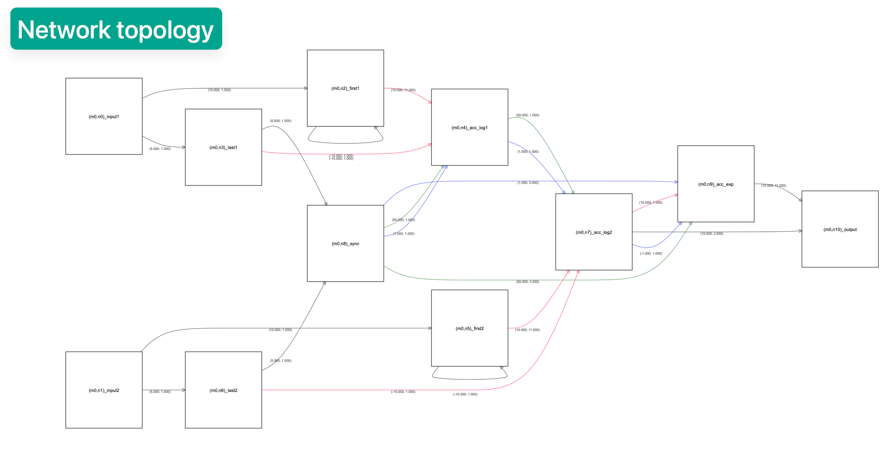
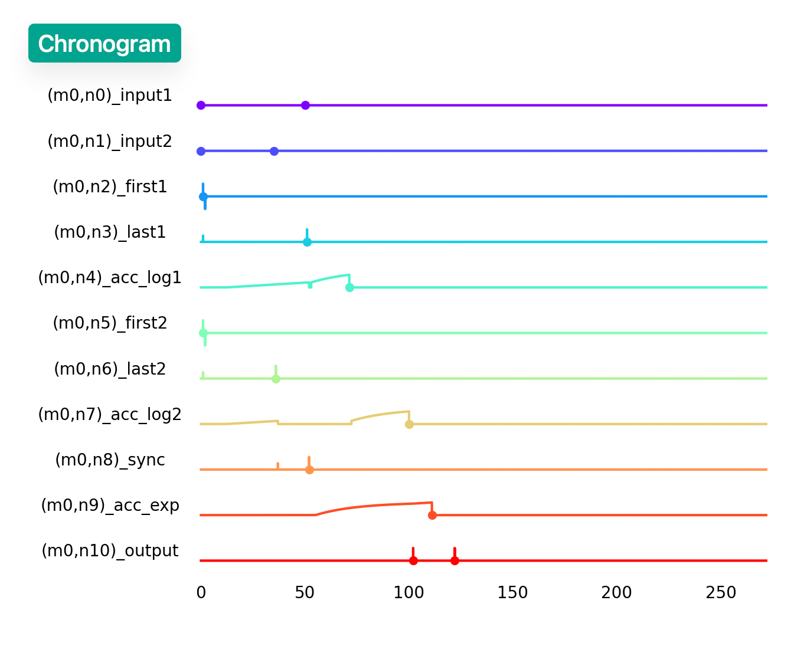

# Simulator engine

The Axon SDK simulates Spiking Neural Networks (SNNs) built with the [STICK](https://arxiv.org/abs/1507.06222) framework. This document describes the simulation engine's architecture, parameters, workflow, and features.

---

## Purpose

The `Simulator` class provides a discrete-time, event-driven environment to simulate:

- Spiking neuron dynamics
- Synaptic event propagation
- Interval-based input encoding and output decoding
- Internal logging of voltages and spikes

It is optimized for symbolic, low-rate temporal computation rather than high-frequency biological modeling.

```python
from axon_sdk.simulator import Simulator
```


##  Core Components
The `Simulator` wraps a SNN, defined as an `SpikingNetworkModule`, inputs spikes to it and simulates its dynamics.

```python
class Simulator:
    def __init__(self, net: SpikingNetworkModule, encoder: DataEncoder, dt: float = 0.001):
      ...
```

These are the components needed to instantiate a new simulator:

| Component          | Description |
|-------------------|-------------|
| `net`             | The user-defined spiking network (a `SpikingNetworkModule`) |
| `encoder`         | Object for encoding/decoding interval-coded values |
| `dt`              | Simulation timestep in seconds (default: `0.001`) |

Calling `.simulate(simulation_time)` executes the simulation.

> **Note:** It's the user's responsability to set an appropriate `simulation_time` that allows the SNN to finalize its dynamic evolution.


## Simulation logs

The simulator logs relevant information during the simulation, which can be retrieved once it's finished:

| Property          | Description |
|-------------------|-------------|
| `.spike_log`             | Dictionary mapping neurons to the timing of their emitted spikes |
| `.voltage_log`         | Dictionary mapping neurons to the evolution of their membrane potentials |


##  Input injection

The `Simulator` is responsible for inputting values to the SNN:

| Property          | Description |
|-------------------|-------------|
| `.apply_input_value(value, neuron, t0)`| Encodes a value and inputs their corresponding spikes |
| `.apply_input_spike(neuron, t)`| Inputs an individual spike |


## Visualization

Axon provides visualization tools for debugging purposes:
- Network topology visualization
- Chronogram

These visualizations are shown once the simulation is done.

To enable the visualization tools, the environment variable `VIS` must be set

| Environment Variable  | Description |
|-------------------|-------------|
| `VIS=1`| Opens visualization after simulation |

**Usage example:**

```bash
VIS=1 python mul_network.py
```





## Example usage

```python
from axon_sdk.simulator import Simulator
from axon_sdk.networks import MultiplierNetwork
from axon_sdk.primitives import DataEncoder

encoder = DataEncoder()
net = MultiplierNetwork(encoder)
sim = Simulator(net, encoder, dt=0.001)

a, b = 0.4, 0.25
sim.apply_input_value(a, net.input1, t0=0)
sim.apply_input_value(b, net.input2, t0=0)
sim.simulate(simulation_time=400)

spikes = sim.spike_log.get(net.output.uid, [])
interval = spikes[1] - spikes[0]
decoded_val = encoder.decode_interval(interval)
```

```text
decoded_val
>> 0.1
```

## Summary
* Event-driven, millisecond-resolution simulator
* Supports interval-coded STICK networks
* Accurate logging of all internal neuron dynamics
* Integrates seamlessly with compiler/runtime interfaces


