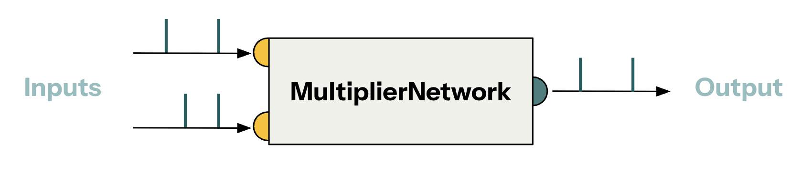
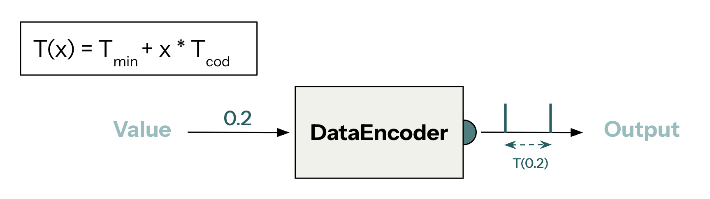

# Quickstart

This tutorial will showcases how to use Axon to build a Spiking Neural Network (SNN) capable of multiplying two signed numbers. In particular, it covers how to define the SNN, input values to it, simulate its execution and read out the output.


## Multiplier and encoder

The spiking neural networks (SNN) defined with **Axon SDK** are quite different from what's conventionally understood by spiking neural networks. They have 2 fundamental differences:

- Axon's SNNs don't need to be trained.
- Axon uses a pair of spikes to encode a value.

Axon's SNNs are pre-defined networks of neurons and synapses that implement a certain computation - they are not a trainable SNN.

One of such computations is a multiplication operation, which is available in Axon:

```python
from axon_sdk.networks import MultiplierNetwork

multiplier_net = MultiplierNetwork(encoder)
```



Axon abstracts the complexity of the underlying SNN into a modular interface that allows composing computation kernels to achieve larger operations.

The multiplier network requires an *encoder* to work. The encoder is the component that translates between arithmetic values and spike intervals.



```python
from axon_sdk.primitives import DataEncoder

encoder = DataEncoder(Tmin=10.0, Tcod=100.0)

spikes = enc.encode_value(0.2)
interval = spikes[1] - spikes[0]
value = enc.decode_interval(interval)
```
```text
>> spikes
>> (0, 30.0)
>> value
>> 0.2
```

## Simulating the SNN

There is one last fundamental ingredient to execute the SNN - the *simulator*:

```python
from axon_sdk.primitives import Simulator

sim = Simulator(multiplier_net, encoder, dt=0.01)
```

The simulator runs a sequential execution of the dynamics of the SNN, hence the need of a simulation timestep parameter (`dt`).

The simulator also allows to input values to the network. Under the hood, it uses the encoder to do so:

```python
sim.apply_input_value(0.5, neuron=net.input1)
sim.apply_input_value(0.5, neuron=net.input2)
```

The last step is to run the simulation and to readout the spikes emitted by the output neuron

```python
sim.simulate(simulation_time=400)
spikes = sim.spike_log.get(net.output.uid, [])

interval = spikes[1] - spikes[0]
output_val = encoder.decode_interval(interval)
```
```text
>> output_val
>> 0.2
```


Instead of using spiking rates to encode values which encode values over many spikes, Axon uses inter-spike intervals. The delay betweekn a couple of spikes encodes a value. This makes Axon extremely spike sparse, hence optimizing for energy consumption (when deploying spiking neural networks to hardware, processing each spike has an energy cost)

