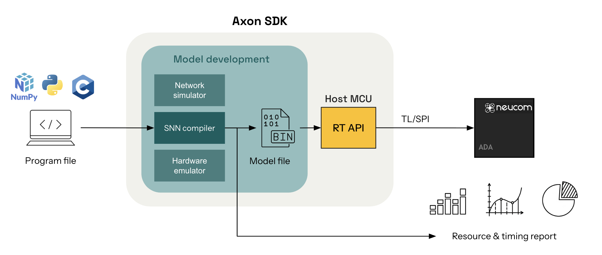

# Axon: The STICK Software Development Kit

The brain, a truly efficient computation machine, encodes and processes information using discrete spikes. Inspired by this, we've built **Axon**, a neuromorphic software framework for building, simulating, and compiling **Spiking Neural Networks (SNNs)** for general-purpose computation. Axon allows to build complex computation by combining modular computation kernels, avoiding the challenge of having to train case-specific SNN while maintaining the sparsity of spike computing.

Axon is an extension of **[STICK (Spike Time Interval Computational Kernel)](https://arxiv.org/abs/1507.06222)**.



> The code is open-source on [Gihub > Axon SDK](https://github.com/neucom-aps/axon-sdk)

Axon provides an end-to-end pipeline for deploying deterministic algorithms as interval-coded SNNs to ultra-low-power neuromorphic hardware.

At [Neucom](https://neucom.ai), we're building one of such **neuromorphic chips** and we're calling it **ADA**. ADA aims to marry together the low-power consumption of FPGAs and ASICS while keeping the flexibility and ease of use of microcontrollers.

The Axon SDK includes:

- A **SNN simulator** for accurate emulation of the interval-coded symbolic computation.
- A **compiler** for translating Python-defined algorithms into spiking circuits, ready for simulation or deployment.
- **Resource reporting** tools for latency estimation and performance profiling of the deployed algorithms.

If you're building symbolic SNNs for embedded inference, signal processing, control, or cryptographic tasks, Axon makes it easy to translate deterministic computations into spiking neural networks.


## Axon SDK structure

| Component           | Description                                                                 |
|---------------------|-----------------------------------------------------------------------------|
| `axon_sdk.primitives`    | Base clases defining the low level components and engine used by the spiking networks|
| `axon_sdk.networks`    | Library of modular spiking computation kernels |
| `axon_sdk.simulator`    | Spiking network simulator to input spikes, simulate dynamics and read outputs |
| `axon_sdk.compilation`     | Compiler for transforming high-level algorithms into spiking networks   |


## Example: Float multiplication SNN
```python
from axon_sdk.simulator import Simulator
from axon_sdk.networks import MultiplierNetwork

encoder = DataEncoder(Tmin=10.0, Tcod=100.0)
net = MultiplierNetwork(encoder)

val1 = 0.1
val2 = 0.5

sim = Simulator(net, encoder, dt=0.01)

# Apply both input values
sim.apply_input_value(val1, neuron=net.input1, t0=10)
sim.apply_input_value(val2, neuron=net.input2, t0=10)

# Simulate long enough to see output
sim.simulate(simulation_time=400)

spikes = sim.spike_log.get(net.output.uid, [])
interval = spikes[1] - spikes[0]
decoded_val = encoder.decode_interval(interval)
```
```text
decoded_val
>> 0.05
```

## Citation
If you use **Axon** in your research, please cite:
```
@misc{axon2025,
  title        = {Axon: A Software Development Kit for Symbolic Spiking Networks},
  author       = {Neucom},
  howpublished = {\url{https://github.com/neucom/axon}},
  year         = {2025}
}
```

## License
The **Axon SDK** is open-sourced under a **GPLv3 license**, preventing by default its inclusion in closed-source projects. However, reach out to initiate a collaboration if you'd like to incorporate Axon into your closed-source project.


<p align="right">
  
</p>