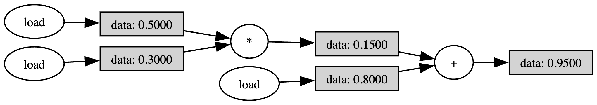
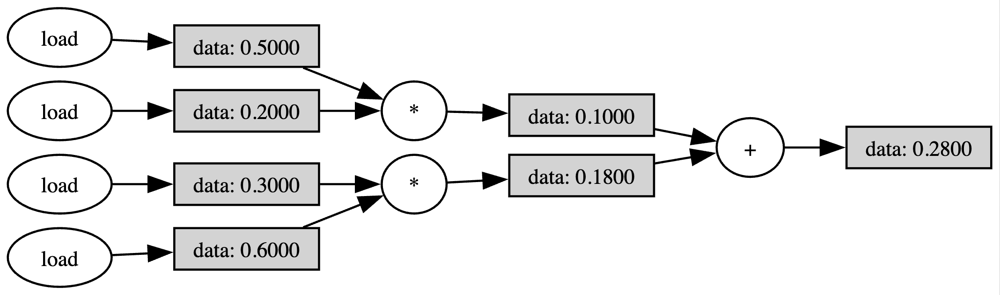

# Using the computation compiler

So far, we have combined **manually** different computational blocks to achieve a larger computation (for example, in the tutorial [Combining computations](comb-computation.md)). However, that becomes unfeasible when wanting to run larger computations or even full algorithms.

**Axon SDK** provides a computation *compiler* that translates a computation defined in Python to its corresponding spiking network, which implements such computation. The goal of this tutorial is to introduce the **computation compiler**.

## The `Scalar` class

**Axon SDK** provides a class whose purpose is to track the computations applied to scalar values. That class is called `Scalar`.

The `Scalar` base class wraps floating-point scalars with the purpose of logging the operations performed over them during algorithms.

```python
from axon_sdk.compilation import Scalar

a = Scalar(0.5)
x = Scalar(0.3)
b = Scalar(0.8)
```

The **Axon** compiler works by logging the subsequent computations performed over scalars, building a computation graph and finally, transforming it into its equivalent spiking network.

After the variables are tracked by a `Scalar`, we can use them as we would in normal Python syntax to implement algorithms:

```python
y_mac = a * x + b
```

We can also visualize the built computation graph:

```python
y_mac.draw_comp_graph(outfile='MAC_computation_graph')
```



The computation graph is a graphical representation of a computation where each *node* represents an operation and each *edge* a scalar value.

It's possible to use more complex computations over variables wrapped by `Scalar`. Everything works as expected:

```python
from axon_sdk.compilation import Scalar

def dot_prod(a: list[Scalar], b: list[Scalar]):
    return a[0] * b[0] + a[1] * b[1]

a = [Scalar(0.5), Scalar(0.3)]
b = [Scalar(0.2), Scalar(0.6)]

y_dot = dot_prod(a, b)
```

```python
y_dot.draw_comp_graph(outfile='dot_computation_graph')
```



Once we have a computational graph built, we can transform it into a spiking network using the compiler.

## From computation graph to spiking network

**Axon** provides a compilation module with methods for performing the compilation process and objects to hold the output of the compilation. The `compile_computation()` method transforms a computation graph to a spiking network:

```python
from axon_sdk.compilation import ExecutionPlan, compile_computation
from axon_sdk.compilation import Scalar

a = Scalar(0.5)
x = Scalar(0.3)
b = Scalar(0.8)

y = a * x + b

exec_plan = compile_computation(y, max_range=1)
```

> **Note:** Since our variables in this example are bounded by 1, we can use a `max_range=1`. Using a larger range allows to perform computations with an extended numeric range, but that comes at a cost of precision when executing the spiking network.

The output of the compilation process is an `ExecutionPlan`.

```text
ExecutionPlan
 | net
 | triggers
 | reader
```

The execution plan contains the generated spiking network in `net`. Besides, it contains `triggers` objects that automatically handle the process of inputting data to the spiking net (taking care of value range normalization and sign) and `reader`, for reading the output of the network.

The execution plan is ready to be simulated:

## Simulating the spiking computation

The simulator knows how to run the execution plan produced by the compilation:

```python
from axon_sdk.simulator import Simulator

encoder = DataEncoder(Tmin=10.0, Tcod=100.0)

sim = Simulator.init_with_plan(exec_plan, enc)
sim.simulate(simulation_time=600)
```

All that is left is to readout the output spikes and decode the value

```python
spikes_plus = sim.spike_log.get(execPlan.output_reader.read_neuron_plus.uid, [])
```

```text
spikes_plus
>> [381.94, 486.94]

encoder.decode_interval(spikes_plus[1] - spikes_plus[0])
>> 0.95
```

As expected, the spiking network outputs spikes that, when decoded, have computed `0.5 * 0.3 + 0.8 = 0.95`.

## Supported operations

The current version of the compiler supports the following scalar operations:

| Operation          | Description  |
|---------------------|-----------------------------------------------------------------------------|
| `ADD`    | a + b |
| `NEG`    | - b |
| `MUL`    | a * b |
| `DIV`    | a / b |

Only algorithms that use the Python operators `+`, `-`, `*` and `\` can be compiled to spiking networks.

Other primitive arithmetic operations (`EXP`, etc.), complex operations (`RELU`, etc.) and control flow operations (`BEQ`, etc.) will be added in future releases.

Feel free to submit requests to extend the supported operations in our [Github issues](https://github.com/neucom-aps/axon-sdk/issues).


## Using an extended numerical range

In the example before, the input variables were bounded by 1. Both the input values and any intermediate value had to be in the range `[-1, 1]`.

> **Important:** It's the users responsability to guarantee that any input value and intermediate computation value is in the range `[-1, 1]`.
> The current version of the compiler does not detect overflows. Failure to comply to this will yield an unreliable spiking execution.

However, we can use an extended numerical range which grants more computational freedom by adjusting `max_range`:

```python
a = Scalar(5)
x = Scalar(3)
b = Scalar(8)

y = a * x + b

exec_plan = compile_computation(y, max_range=100)
```

It's still the user's responsability to guarantee that the input and intermediate values are within [-`max_range`, `max_range`].

Behind the scenes, both the simulator and the spiking network are reconfigured to take care of the extended numeric range. Inputs are linearly squeezed to `[-1, 1]` and intermediate operations compensate the normalization constant.

For example, multiplications must compensate for an extra `max_range` in the denominator:

```text
a * b -> (a / max_range) * (b / max_range) -> a * b / (max_range)^2
```

From a user's perspective, everything behaves as expected:

```python
encoder = DataEncoder(Tmin=10.0, Tcod=100.0)

sim = Simulator.init_with_plan(exec_plan, enc)
sim.simulate(simulation_time=600)

spikes_plus = sim.spike_log.get(exec_plan.output_reader.read_neuron_plus.uid, [])
```

The only difference is that, now, the readout value must be de-normalized:

```python
decoded_val = enc.decode_interval(spikes_plus[1] - spikes_plus[0])
de_norm_value = decoded_val * exec_plan.output_reader.normalization
```

```text
de_norm_value
>> 23
```