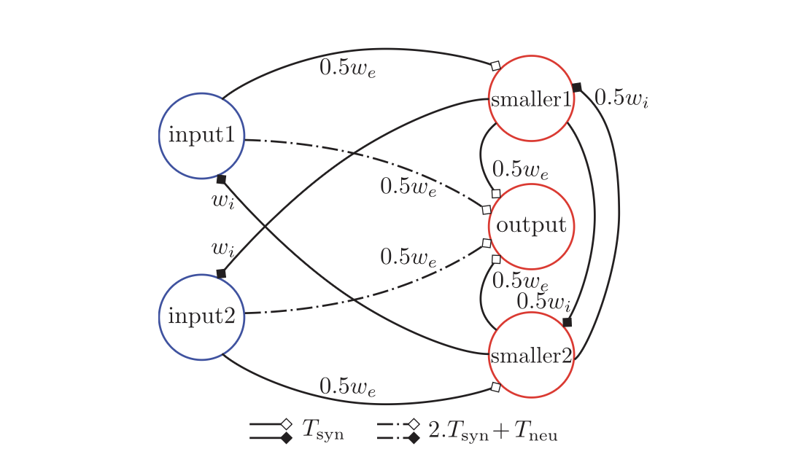

# Building custom spiking modules

In other tutorials, we have used the spiking modules provided by the **Axon SDK** library or combined them to define complex computations. However, in certain cases one might need to define modules from scratch. **Axon SDK** provides an infrastructure to do that.

In this tutorial, we will implement from scratch a module that computes the minimum between two input values. This is, a `MinNetwork` module, which is not part of the **Axon** library (yet).

## `MinNetwork`: compute the minimum

**Axon** is based on the theoretical foundation introduced by the STICK framework, presented in the paper [STICK: Spike Time Interval Computational Kernel, A Framework for General Purpose Computation using Neurons, Precise Timing, Delays, and Synchrony](https://arxiv.org/abs/1507.06222). In the paper, there is a design for a spiking network that computes the minimum between two floating point values, which is the one we will implement in this tutorial.

> **Note:** For a deep understanding of the operating principles behind STICK and the workings of the minimum network, the STICK paper contains a great explanation. If you're interested in learning about it, please, **refer to the paper**. This tutorial will only address the implementation and simulation of the network in Axon.

This is the spiking network presented in the paper to compute the minimum between two inputs:



Let's break down the meaning of the graph, step by step.

Each *node* represents a spiking neuron and each *edge*, a synaptic connection.

Each synapse has 3 parameters which define it's properties:

```text
Synapse
 | - type
 | - weight
 | - delay
```

All synapses are black and therefore *V-type* synapses (as presented in the paper).

The *weight* of each synapse is plotted by it. We can see the values `we`, `wi` and combinations of them with a preceding factor. The weight `we` stands for *weight excitatory* and means that a synapse with weight `we` will cause the receiving neuron to **spike immediately** (in the next update cycle). The `wi` stands for *weight inhibitory* and has the contrary effect: After receiving a `wi` synapse, a neuron will need `2x we` to spike.

The *delays* of the synapses, indicated by the line type, have the values `Tsyn` and `Tsyn + Tneu`. The first, `Tsyn`, stands for *synapse time* and it's an arbitrary but constant value, usually set to `Tsyn=1`. The second, `Tneu` stands for *neuron propagation time* and is the time a neuron takes to spike after its membrane potential went over the spiking threshold. Since we're using a sequential simulator, `Tneu = dt`.

## Presenting the `SpikingNetworkModule`

All spiking modules must be childs of a base class called `SpikingNetworkModule`. Creating new modules requires subclassing it as well.

```python
from axon_sdk.primitives import SpikingNetworkModule

class MinNetwork(SpikingNetworkModule):
    def __init__(self, encoder, module_name=None):
        super().__init__(module_name)
        ...
```

The `SpikingNetworkModule` does basic housekeeping: keeps track of child submodules and neurons, makes sure submodules have unique IDs, and provides methods to wire larger modules together. In short, it allows **modularity** and **composability** when building complex spiking networks.

## Building the Minimum Network

We can follow the graph describin the **minimum network** from the [STICK paper](https://arxiv.org/abs/1507.06222) and wire a new spiking module:

```python
class MinNetwork(SpikingNetworkModule):
    def __init__(self, encoder, module_name='min_network'):
        super().__init__(module_name)

        # neuron params
        Vt = 10.0  # threshold voltage
        tm = 100.0
        tf = 20.0

        # synapse params
        we = Vt
        wi = -Vt
        Tsyn = 1.0
        Tneu = 0.01

        self.input1 = self.add_neuron(Vt, tm, tf, neuron_name='input1')
        self.input2 = self.add_neuron(Vt, tm, tf, neuron_name='input2')
        self.smaller1 = self.add_neuron(Vt, tm, tf, neuron_name='smaller1')
        self.smaller2 = self.add_neuron(Vt, tm, tf, neuron_name='smaller2')
        self.output = self.add_neuron(Vt, tm, tf, neuron_name='output')

        # from input1
        self.connect_neurons(self.input1, self.smaller1, "V", 0.5 * we, Tsyn)
        self.connect_neurons(self.input1, self.output, "V", 0.5 * we, 2 * Tsyn + Tneu)

        # from input2
        self.connect_neurons(self.input2, self.smaller2, "V", 0.5 * we, Tsyn)
        self.connect_neurons(self.input2, self.output, "V", 0.5 * we, 2 * Tsyn + Tneu)

        # from smaller1
        self.connect_neurons(self.smaller1, self.input2, "V", wi, Tsyn)
        self.connect_neurons(self.smaller1, self.output, "V", 0.5 * we, Tsyn)
        self.connect_neurons(self.smaller1, self.smaller2, "V", 0.5 * wi, Tsyn)

        # from smaller2
        self.connect_neurons(self.smaller2, self.input1, "V", wi, Tsyn)
        self.connect_neurons(self.smaller2, self.output, "V", 0.5 * we, Tsyn)
        self.connect_neurons(self.smaller2, self.smaller1, "V", 0.5 * wi, Tsyn)
```

Once built, we can use the simulator to run the dynamics of the network. Refer to the tutorial on [Combining computations](../tutorials/comb-computation.md) for a longer explanation about the simulator.

```python
from axon_sdk.simulator import Simulator
from axon_sdk.primitives import DataEncoder

encoder = DataEncoder(Tmin=10.0, Tcod=100.0)
min_net = MinNetwork(encoder, 'min')
sim = Simulator(min_net, encoder)
```

What's the smaller value between `0.7` and `0.2`? That's a hard question. Let's find it out:

```python
val1 = 0.7
val2 = 0.2

sim.apply_input_value(val1, min_net.input1, t0=0)
sim.apply_input_value(val2, min_net.input2, t0=0)

sim.simulate(300)
```

Now, we can readout the spikes produced by the output neuron and decode the computed result:

```python
spikes = sim.spike_log.get(min_net.output.uid, [])
```

```text
spikes
>> [2.0100000000000002, 32.01]

encoder.decode_interval(spikes[1] - spikes[0])
>> 0.19999999999999996
```

