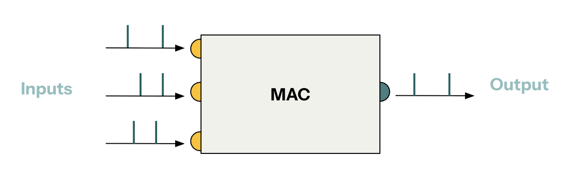
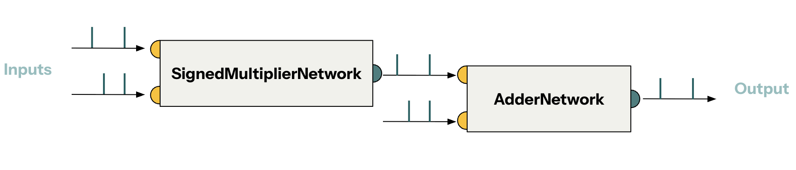
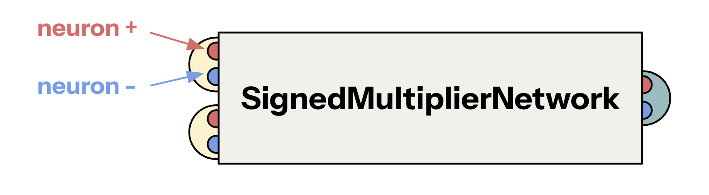

# Combining computations

**Axon SDK** provides a library of modular spiking computation kernels that can be combined to achieve complex computations. In this tutorial, we will build a Spiking Multiply-Accumulate module by combining primitive modules.

## Spiking Multiply-Accumulate (MAC)

A multiply-accumulate computation over signed scalars takes the following form:

```text
y = a * x + b
```



**Axon** provides spiking modules to implement **signed multiplication** and **addition** as part of its library. Combining them, we can build a MAC module.

| Module          | Description  |
|---------------------|----------------------------- |
| `SignedMultiplierNetwork`    | Multiplies two signed scalars |
| `AdderNetwork`    | Adds two signed scalars |

Combining modules requires wiring them together. We will see how to wire the modules together later on.



## Signed channels in spiking modules

Signed arithmetics is achieved by having two channels per input/output (one channel for each sign). Therefore, *pair of spikes* in a certain channel encodes a signed value.

Each module that supports signed arithmetics contains two neurons per input/output:


| Module          | Inputs  | Outputs | 
|---------------------|-----------------------------| --- |
| `SignedMultiplierNetwork`    | `net.input1_plus` | `net.output1_plus` |
|                              | `net.input1_minus` | `net.output1_minus` | 
|                              | `net.input2_plus` | |
|                              | `net.input2_minus` | |
| `AdderNetwork`    | `net.input1_plus` | `net.output1_plus` |
|                              | `net.input1_minus` | `net.output1_minus` | 
|                              | `net.input2_plus` | |
|                              | `net.input2_minus` | |

## Wiring modules together

Putting together the MAC module is a matter of wiring together the `SignedMultiplierNetwork` and `AdderNetwork`, making sure to wire *plus* to *plus* and *minus* to *minus*.

```python
from axon_sdk.networks import SignedMultiplierNetwork, AdderNetwork
from axon_sdk.primitives import SpikingNetworkModule

class MacNetwork(SpikingNetworkModule):
    def __init__(self, encoder):
        super().__init__()

        we = 10.0
        Tsyn = 1.0

        self.add_net = AdderNetwork(encoder)
        self.mul_net = SignedMultiplierNetwork(encoder)

        self.connect_neurons(self.mul_net.output_plus,
            self.add_net.input1_plus,
            synapse_type="V",
            weight=we,
            delay=Tsyn
        )
        self.connect_neurons(self.mul_net.output_minus,
            self.add_net.input1_minus,
            synapse_type="V",
            weight=we,
            delay=Tsyn
        )

        self.add_subnetwork(add_net)
        self.add_subnetwork(mul_net)
```

Defining the new MAC module, or any new module, requires subclassing `SpikingNetworkModule`. This base class does basic housekeeping (e.g. making sure each child module has a unique ID, etc.)

> **Note:** The call to `self.add_subnetwork(...)` is important. It's required for the base class to register the new module as a child. Without it, the simulation of the dynamics (which we'll do later on) will not work properly.

There are several things to explain from the snippet above: the origin of the values `we`, `Tsyn` and `V`:

The variable `we` stands for *weight excitatory* and it's a term used throught **Axon**. It's the weigth of a synapse that will excite (trigger) the following neuron in a single timestep. Using `we=10.0` comes from the fact that neurons, usually, have a voltage threshold `Vt=10`, defined in each module (look inside `signed_multiplier.py`).

The variable `Tsyn` stands for *synapse time* and using it's the time delay introduced by the synapse. The value `Tsyn=1.0` is used by default throughtout **Axon**. It's arbitrary and can be changed without affecting the dynamics of the spiking networks.

The synapses used to connect the modules are of type `V`. V-synapses cause the following network to spike right after receiving a spike. Hence, they are used to propagate information forward in the network.

## The simulator

In order to make the network spike, we need some sort of engine that handles the simulation of the dynamics of the spikes. That engine is the `Simulator`.

```python
from axon_sdk.simulator import Simulator
from axon_sdk.primitives import DataEncoder

encoder = DataEncoder(Tmin=10.0, Tcon=100.0)

mac_net = MacNetwork(encoder)
sim = Simulator(mac, encoder, dt=0.01)
```

For an explanation about how `DataEncoder` encodes values, take a look at [Core concepts > Interval coding](../core-concepts/interval-coding.md)

The simulator evolves the spiking module sequentially with a timestep of `dt`. Using `dt=0.01` is enough to get accurate simulations for most networks. In some cases, `dt=0.001` is also used. In general, we want `dt << Tsyn`.

### Inputs & outputs

The simulator is in charge of inputting spikes to the network.

Let's set some numeric values for the MAC operation:

```text
a = 0.5
x = 0.3
b = 0.8
```

Using those:

```text
y = a * x + b = 0.95
```

We can use the simulator's method `.apply_input_value(val, neuron, t)` to input spikes to the network.

```python
a = 0.5
x = 0.3
b = 0.8

sim.apply_input_value(a, mac_net.mul_net.input1_plus, t0=0)
sim.apply_input_value(x, mac_net.mul_net.input2_plus, t0=0)
sim.apply_input_value(b, mac_net.add_net.input2_plus, t0=0)
```

The method `Simulator.apply_input_value(val, neuron, t)` automatically applies a couple of spikes encoding a value to a neuron at a timestep `t`. To input an individual spike, there is also `Simulator.apply_input_spike(neuron, t)`.


Since in this example all inputs are positive, we can manually input them to the plus neurons. Inputing values manually is an academic exercise which does not scale to real-world scenatios. In further tutorials we'll see how to automate this process.


### Running the simulation

Now, it's just a matter of letting the simulation run for a certain amount of time:

```python
sim.simulate(simulation_time=500)
```

If everything went fine, the plus output of the adder module should have spiked twice, and the interval between the spikes will encode the desired value - 0.95.

```python
spikes_plus = sim.spike_log.get(mac_net.add_net.output_plus.uid, [])
```

```text
spikes_plus
>> [381.94, 486.94]
encoder.decode_interval(spikes_plus[1] - spikes_plus[0])
>> 0.95
```


